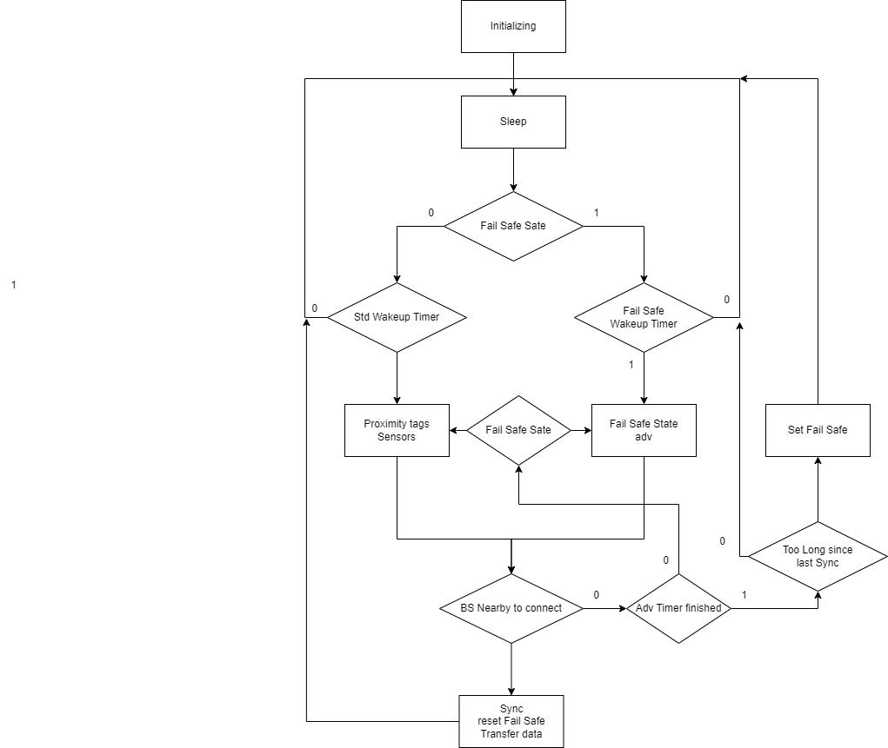
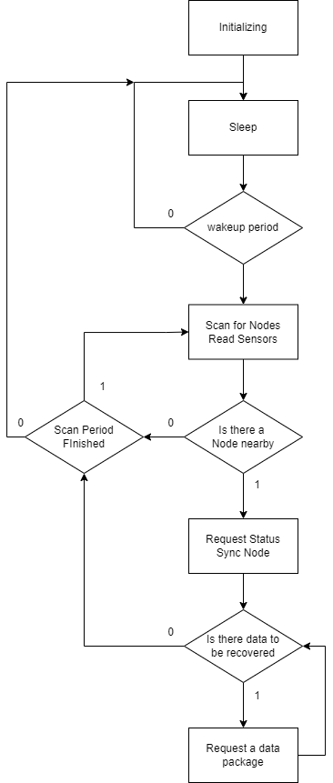

# MarmoNet

MarmoNet is an advanced biotelemetry system designed to track and monitor the behavior and life models of small marmosets living in urban environments. It was specifically developed as part of the larger project "Marmosets of Butantã" (freely translated from Saguis do Butantã, please follow our [Instagram](https://www.instagram.com/saguisdobutantan/)). This initiative aims to enhance our understanding of marmoset behavior in city parks and other urban spaces. The project is a collaboration between Instituto Butantan and the USP Campus and seeks to improve knowledge about the animals' ecology and adaptability in human-dominated environments.

Marmosets are highly intelligent creatures; [recent studies have even shown that they have the ability to name themselves](https://www.theguardian.com/science/article/2024/aug/29/marmosets-behaviour-specific-names-study). They also exhibit remarkable adaptability, which is why they are commonly found in city parks and near human settlements. Understanding how these animals thrive in urban environments is crucial for designing healthier, more wildlife-friendly cities.

Although the primary focus of MarmoNet is on urban marmosets, we hope that its design will serve as a foundation for other biotelemetry projects in the future. The system is intended to be flexible enough for adaptation in various research settings.

The MarmoNet system was developed using [Pulga](https://wiki.caninosloucos.org/index.php/Pulga), a Brazilian microcontroller unit (MCU) created and designed at USP. It runs on [pulga-riot](https://github.com/caninos-loucos/pulga-riot), a variant based on the original [RiotOS](https://github.com/RIOT-OS/RIOT).

# The Fundamentals of MarmoNet

MarmoNet is a Wireless Sensor Network (WSN) designed to monitor marmosets in urban environments. The system consists of internal nodes (devices that collect data), Base Stations (BS), which aggregate data from the nodes, and a sink device, known as the Aggregator, which collects data from all the Base Stations. As illustrated in the figure, the internal region is monitored by the nodes, and the border is defined by the Base Stations (a logical, not a physical, boundary). The aggregated data is then sent to the Aggregator, allowing biologists to study it.

IMAGE TBD

Marmosets are highly intelligent animals with a very low recapture rate. This makes it impractical to use systems that require frequent battery changes or manual data recovery. As a result, MarmoNet was designed with an energy-efficient topology. To reduce power consumption, the system is synchronized: all devices wake up at the same time to collect and transmit data. Base Stations are responsible for resynchronizing the nodes they detect, while the Aggregator synchronizes the Base Stations.

MarmoNet also addresses the challenge of resource usage in spatiotemporal analysis while helping researchers better understand the social behavior of marmosets. The types of data MarmoNet can collect include:

- RFID: Each node detects other node IDs and logs when the interaction occurs.
- Barometer: Measures air pressure, enabling inferences about the animal's height.
- Temperature: Monitors ambient temperature.
- Relative Air Humidity (feature coming soon, still has a bug).
- Light Sensor (TBD).

MarmoNet can be configured for different behaviors (e.g., duty cycles, sensor activation) using the configuration file [**marmonet_params.h**](), which holds the parameters to customize the network. Additionally, [**marmonet_structs.h**]() defines how the data is structured within the network, ensuring correct data recovery.

## Node


The Node is the device attached to the marmoset. It operates on a timed routine, waking up every WAKEUP_PERIOD. When activated, the Node collects data from its sensors and records the IDs of nearby nodes, functioning similarly to an RFID/proximity tag.

The Node uses Bluetooth Low Energy (BLE) with a broadcast topology to reduce communication overhead between nodes, thereby minimizing energy consumption. The broadcast transmits the marmoset's ID and the Node's status (either FailSafe or Std) using Time Division Multiple Access (TDMA). This allows all nodes to communicate with nearby nodes in an energy-efficient manner.

The Node can connect to a Base Station (BS) to send the collected data for aggregation and resynchronization.



## BS

The BS is responsible to collect the data from the Node, sync the Nodes and activate/deactivate sensors.




## Others elements

To attach the node to the animal it was developed a collar:

We hope that soon we will develop an app to collect the data from the BS and save it in the database :)


# Installation

**We strongly recommend you to read all the installation process before start**

To test this software please install all the [depences of RiotOS](https://doc.riot-os.org/getting-started.html) to your OS and git clone [pulga-riot](https://github.com/caninos-loucos/pulga-riot):

```
sudo apt update
sudo apt install git gcc-arm-none-eabi make gcc-multilib libstdc++-arm-none-eabi-newlib openocd gdb-multiarch doxygen wget unzip python3-serial
git clone https://github.com/caninos-loucos/pulga-riot.git
```

You will need to place the MarmoNet repo inside the **Examples/** folder of pulga-riot. It can be done using: 

```
cd pulga-riot/examples/
git clone https://github.com/JoseColombini/MarmoNet.git
```
Once you done it you can compile the code by just going to the directory of the part you want to build and using the command
```
make
```
All the configuration to compile is built in the make file, but the flashing process is not, if you want to flash it please use the appropriate tool, [please install JLink](https://www.segger.com/downloads/jlink/)

*Linux* users just use the command 
```
make PORT=/dev/ttyUSB0  flash term
```
*Windows* users use the **JFlashLight** from JLink directory, configure it to teh Device **NRF52840_XXAA** and Interface **SWD** with **4000 kHz**

Worth to remember this is specific for Pulga. Any of the compatible devices from this version of riot can be used but following the appropriate Board configuration commands (more information in [RiotOS page](https://doc.riot-os.org/getting-started.html))


# Information
Engineering Final Project at Escola Politecnica - USP

Project Name: MarmoNet: a biotelemetry system for urban marmosets of the genus *Callithrix*

Author: Jose Colombini

Supervisor: Prof. Bruno Albertini (Engineer) and Dr. Erika Hings-Zaher (Biologist)

Collaborators: Louise Schineider (MSc. biology), Isabella Schrotter (BSc. Biology)

[Full Text can be found here: MarmoNet]()

To cite this work please use:

```
TODO
```
